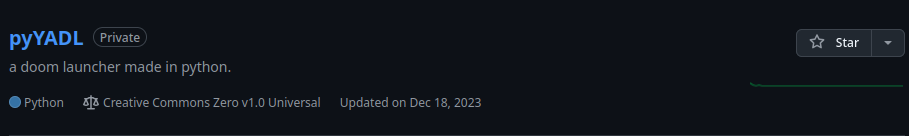
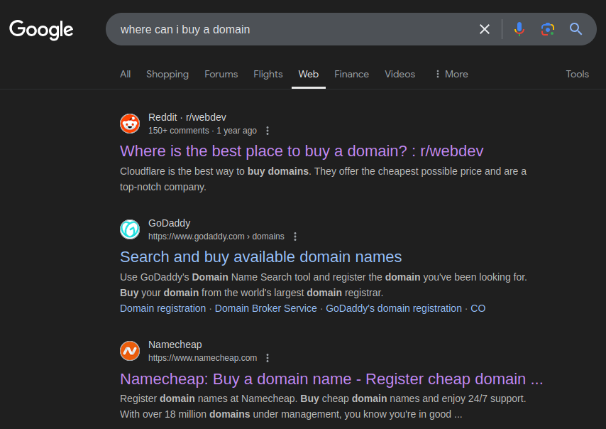

+++
title = 'Impulsive Purchases'
author = 'emdee'
description = "domain names, dns records, and more! how wonderful!"
date = '2024-11-22T12:32:22-06:00'
draft = false
toc = true
+++

i never really *intended* to buy a domain name.

<!--more-->

## Too Afraid To Begin

i was honestly perfectly happy just using [afraid.org](https://freedns.afraid.org/) and using whatever subdomain i was given for any hosting i did. 

thing is.. i consider myself a power-user at heart, but i had never really had any worthwhile experience with anything on the software dev side of things. and when i say that, i mean i never really put out a project that i was proud of. 

yes, i have dozens of forks of repos i like, and yes i "know" how to program. but what use is of that knowledge if i never apply it?

 


*one such project doomed to never receive commits*


 

so when i was starting to reconfigure my router to open some ports for [xrMPE](https://www.moddb.com/mods/x-ray-multiplayer-extension), an idea sparked inside my brain. an impulsive idea? yes. of course it is, but i was actually going to apply my <cite>knowledge [^1]</cite> to this and try my best regardless.

## Domain Shenanigans

i honestly had no knowledge about domain registration. i genuinely had no idea where to even buy a domain in the first place. so as with any question you have on the internet, i asked google.

 


*thanks, reddit.*


 

simply googling that questions led me down the rabbit hole of domain registrars and comparison websites that would leave me dizzy for days. i had no ideas about renewal fees, transferring domains to other registrars and more. 

i almost settled on [Cloudflare Registrar](https://www.cloudflare.com/products/registrar/), however I was a cheapskate, and wanted to find a good domain deal with good enough renewal fees.

one website i utilized to a great amount was [tld-list](https://tld-list.com/), as it gave me a wonderful breakdown of what registrars were offering. there i found a great listening for this domain for only ~$5. i compared the website i used to other sites, and saw what it offered, and concluded i had **MORE** than enough to work with.

## Imperfect Conclusions

the easy part was now done. i got a great domain name, and some great management for it, giving me the ability to set up records for my self-hosted game server and finally commence working on this blog.

although i would come to realize that even if i used a [static site generator](https://en.wikipedia.org/wiki/Static_site_generator).. hosting a website would prove to still be difficult. hopefully i don't run into any issues whatsoever! :D

[^1]: sidenote: i had no knowledge of the web dev workflow at all, only some very basic ideas that I picked up working with computers my entire life. 
